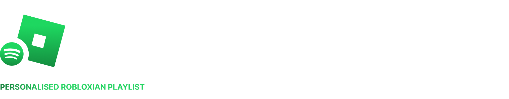
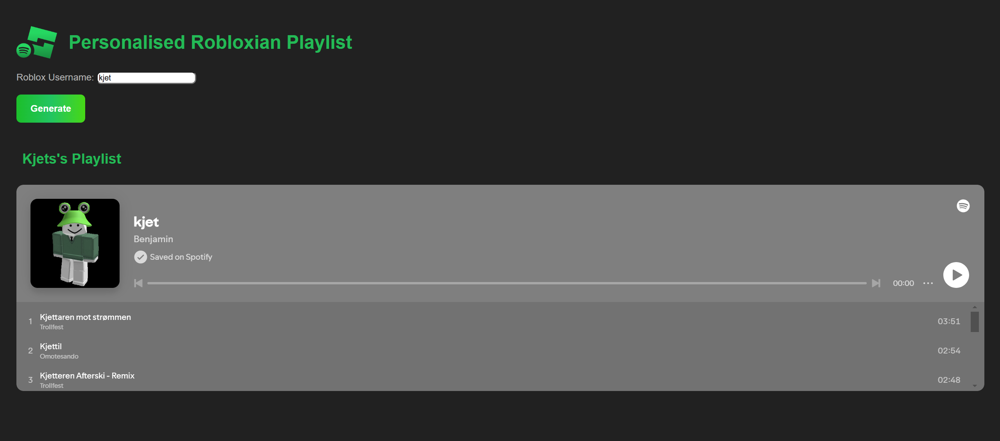
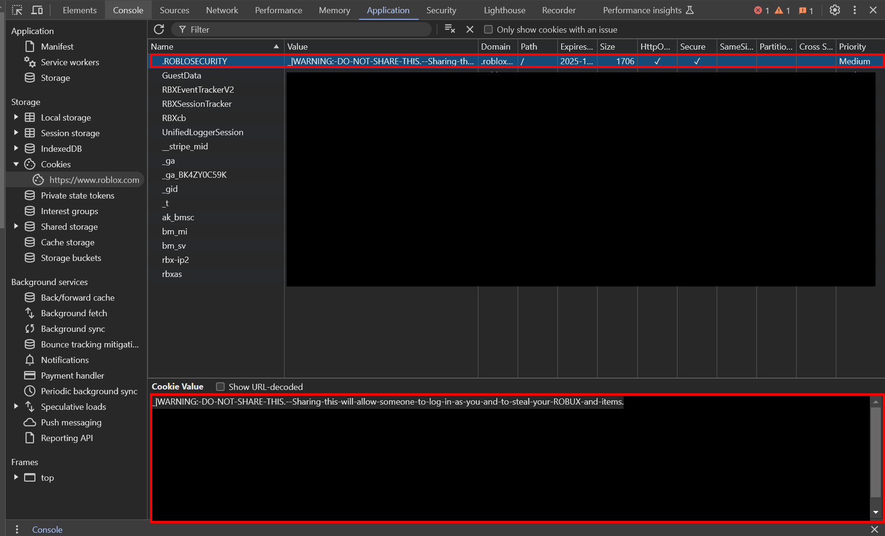

<h4>Playlist Generator Customised For Your Robloxian with Flask</h4>

<h5>This is part of the full <a href="https://github.com/proud-p/spotify-roblox-project">Spotify to Roblox Studio</a> workflow. You can also check out the source code <a href="https://github.com/BenShapley/roblox-spotify-profile">here</a>.</h5> 

  <a href="#key-features">Key Features</a> •
  <a href="#how-to-use">How To Use</a> •
  <a href="#FAQ">FAQ</a> •
  <a href="#credits">Credits</a> 

## Key Features

* Robloxian Searching
  - Search for a specific Roblox player by their username or find similar results
  - Pick from the user from the results to start building the playlist
  
* Playlist Creating
  - Create a playlist based on the Robloxian username
  
* Album Cover Setting

  * Album cover set based on their profile Thumbnail
  * Fully personalised  

* Playlist Opening

  * Playlist opens directly into your browser to start playing!

  

## How To Use

Before trying to run this application, please ensure you install all of the correct libraries to a virtual environment.

> **Note**
> Please refer to the [**requirements.txt**] in the repository to install all of the correct and up-to-date libraries.
>
> To also run flask, please use [**flask run**] to access the local website

1) **Cookie Grabbing**:

   Log into your Roblox account and use *Google Chrome* for easily cookie grabbing

   Enter Inspect Element (CTRL + SHIFT + I) -> Application -> Cookies -> Grab your **.ROBLOSECURITY** cookie

   Save your cookie as a .txt file, saved locally within the repository in a folder named 'keys'.

   > **Note**
   > Do not share this Cookie with anyone, doing so can compromise your account

2. **Run Flask:**

   Run your flask app using **flask run** within your command prompt and open the local website

   > **Note**
   >
   > Ensure you are within your Virtual Environment with all the requirments installed when you run your flask app

3. **Search a Name:**

   Search a Roblox username that you would like the app to generate a playlist for

4. **Hit Generate:**

   Hit the generate button and make your playlist!
   
   
   
   # FAQ
   
   1) **How do I set up a Virtual Environment?**
   
      A: To set up a Virtual Environment, go to where you cloned/downloaded the repository and open up the Command Prompt (CMD). Within CMD, type `virtualenv venv`.
   
      
   
   2) **What is a Roblox Cookie?**
   
      A: Your Roblox Cookie is a unique identifier to your account that allows the API to authenticate that you are logged in. Without this, the API will be unsuccessful when trying to scrape.
   
      
   
   3) **Why cant I find my Roblox Profile?**
   
      A: Sometimes if you search a specific profile, it may not come up. To fix this, type up the Roblox display name rather than their username. This is due to how the Roblox search system works.
   
      
   
   4) **What is the Potential of this System?**
   
      A: This system showcases the power of APIs and how they can be used to bridge the gap between two brands. In this case, it shows how Roblox could partner with Spotify to make some interesting and fun results! The system can also be developed to search for songs based on what the user is wearing or playing rather than name.

## Credits

Huge thanks to:

- [ro.py](https://ro.py.jmk.gg/v2.0.0/)
- [spotipy](https://spotipy.readthedocs.io/en/2.24.0/)
